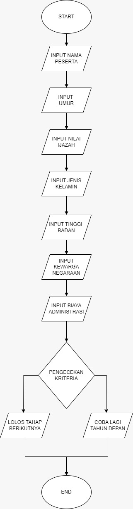

# PROGAM SELEKSI PENERIMAAN CALON TARUNA TNI PRIA

## STUDI KASUS
Dalam seleksi penerimaan calon taruna tni pria terdapat tahap seleksi administrasi untuk tes tahap awal yang akan menentukan lolos tidaknya ke seleksi tes berikutnya.Dalam tes seleksi administrasi terdapat syarat syarat yang harus dipenuhi peserta calon taruna TNI 
Data yang harus diinput:
1.Nama
2.Umur
3.Nilai Ijazah
4.Jenis Kelamin
5.Tinggi badan
6.Kewarganagaraan
7.Biaya Administrasi
Kreteria
Umur < 28
Nilai >= 8.0
Tinggi badan >= 170
Jenis kelamin = Pria
Kewarganegaraan = Indonesia
Biaya Administrasi = 100.000

## FLOWCHART
